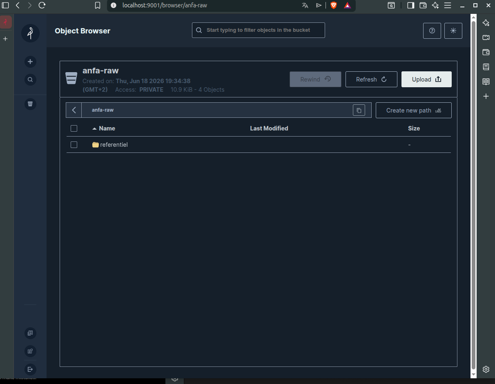

# Rendu Séance 1

**Nom et prénom :** Nassous Abdoulaye Nassour

## Résumé de la séance
Cette séance a permis de mettre en place une infrastructure de stockage objet locale utilisant Docker et MinIO. Nous avons appris à manipuler des conteneurs, à configurer des accès sécurisés via `mc` (MinIO Client) et à automatiser le transfert de données (référentiel Anfa) à l'aide d'un script Python utilisant l'API S3 (via `boto3`).

## Étapes principales
1. **Fork et Clônage :** Création d'une copie du dépôt distant et mise en place de la branche `seance-01`.
2. **Infrastructure MinIO :** Lancement du serveur MinIO avec un volume Docker persistant.
3. **Configuration :** Utilisation de `mc` pour créer un alias, le bucket `anfa-raw` et générer des clés applicatives sécurisées.
4. **Automatisation :** Développement d'un script Python (`upload_referentiel.py`) pour automatiser l'envoi des fichiers CSV vers le bucket.

## Capture d'écran

## Difficultés rencontrées
* Gestion des autorisations Docker (erreurs GPG lors du `docker pull`), résolues après plusieurs tentatives.
* Distinguer les identifiants `root` de la console web des clés applicatives pour les accès programmatiques via `boto3`.

## Exercices d'application

### Exercice 1 : QCM conceptuel
* **1.1 :** **D**. L'open source n'est pas une caractéristique essentielle définie par le NIST[cite: 1].
* **1.2 :** **C**. Gmail est un SaaS (Software as a Service) car tu accèdes au logiciel via un navigateur sans rien gérer de l'infrastructure ou du runtime[cite: 1].
* **1.3 :** **D**. Le FaaS (Function as a Service / Serverless) est idéal ici : exécution événementielle, montée en charge instantanée, aucune gestion de serveur permanent[cite: 1].
* **1.4 :** **C**. Le Cloud hybride permet de garder les données sensibles en privé (on-premise ou cloud privé) tout en utilisant le cloud public pour les traitements nécessitant de l'élasticité[cite: 1].
* **1.5 :** **B**. C'est la dépendance technologique où changer de fournisseur devient complexe et coûteux[cite: 1].
* **1.6 :** **C**. Faux. Les services open source sont souvent aussi performants, voire plus, que les solutions propriétaires, grâce à l'optimisation par la communauté[cite: 1].

### Exercice 2 : Classification de services

| Service | Modèle | Justification |
| :--- | :--- | :--- |
| Google Compute Engine | IaaS | Fournit des machines virtuelles brutes. |
| AWS Lambda | FaaS | Exécution de code granulaire déclenchée par événements. |
| Snowflake | PaaS | Plateforme de données gérée sans gestion de serveur. |
| Heroku | PaaS | Plateforme pour déployer et gérer des applications. |
| Microsoft 365 | SaaS | Logiciels de bureautique accessibles via le web. |
| Databricks | PaaS | Environnement géré pour Spark et la Data Science. |
| Azure Functions | FaaS | Identique à AWS Lambda, axé sur les fonctions. |
| Tableau Online | SaaS | Solution de BI accessible en ligne sans installation. |

### Exercice 3 : Lecture et interprétation
**3.1 Commande Docker :**
* `-d` : Détaché (arrière-plan).
* `--name analyse-anfa` : Nom unique du conteneur.
* `-p 8888:8888` : Mapping des ports hôte/conteneur.
* `-v ...` : Persistance des données via volume.
* `-e ...` : Variable d'environnement pour le token.
* `jupyter/pyspark-notebook` : Image utilisée.
* *Résumé* : Lance un environnement Jupyter/PySpark accessible sur le port 8888 avec synchronisation de dossier local.

**3.2 Lecture docker-compose.yml :**
* **a.** Accès via `http://localhost:9000` et `http://localhost:9001`.
* **b.** Données non perdues car le volume `minio-data` est un volume nommé persistant.
* **c.** Problème : Mots de passe en clair dans le fichier YAML. Utiliser des variables d'environnement (`.env`) est préférable.

### Exercice 4 : Diagnostic
* **a.** Cause : Utilisation des identifiants `root` au lieu des clés applicatives (`anfa-app-key`).
* **b.** Correction : Utiliser les identifiants générés par `mc admin user svcacct add`.
* **c.** Explication : Séparation nécessaire entre droits d'administration et accès programmatiques par sécurité.

### Exercice 5 : Mini-cas d'architecture
* **a.** Limites : (1) Pas d'automatisation (temps réel impossible) ; (2) Risque de perte de données (stockage local).
* **b.** Besoins : Temps réel -> Rapidité ; Pics -> Élasticité ; Partage -> Accès réseau large.
* **c.** Modèles : (i) SaaS ; (ii) FaaS/PaaS ; (iii) IaaS/PaaS.
* **d.** Déploiement : Cloud Hybride (données privées/conformité + calcul public/élasticité).
* **e.** Vendor lock-in : (1) Conteneurs ; (2) Standard Open Source ; (3) Infrastructure as Code (Terraform).