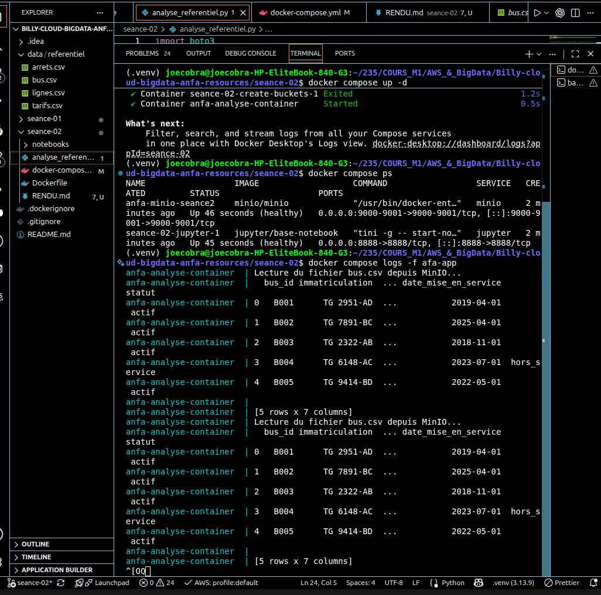
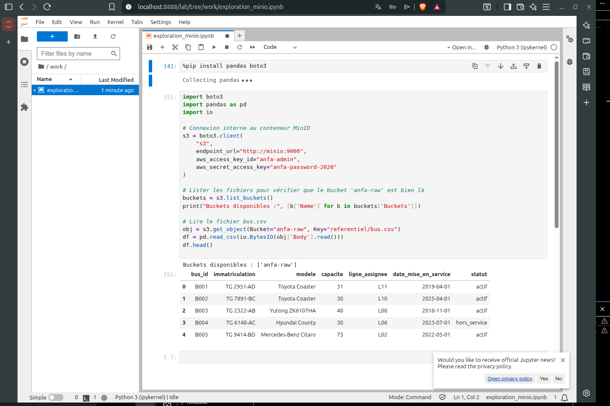
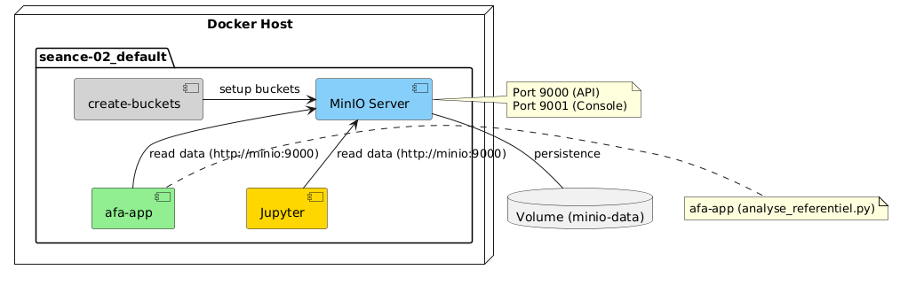

# Rendu Séance 2

**Nom :** NGARTOBAYE OUMAROU BILLY

## Résumé de la séance
L'objectif était de passer de la conteneurisation manuelle à l'automatisation et l'orchestration avancée. Nous avons créé une image Docker optimisée et automatisé le déploiement d'une infrastructure complète avec Docker Compose, incluant le stockage (MinIO), le traitement (Application Python) et l'exploration interactive (Jupyter).

## Étapes accomplies
1. **Dockerfile & Multistage :** Création d'une image basée sur `python:3.11-slim` et implémentation d'une version *multistage* pour optimiser la taille de l'image finale.
2. **Orchestration Multi-services :** Configuration d'un environnement complet :
   - **MinIO :** Serveur de stockage objet.
   - **MinIO Client (mc) :** Automatisation de la création des buckets et du chargement des données initiales.
   - **afa-app :** Application de traitement de données sous Pandas/Boto3.
   - **Jupyter :** Environnement d'exploration de données.
3. **Automatisation :** Utilisation de `healthcheck` et de conditions `depends_on` pour garantir une séquence de démarrage robuste (Attendre que MinIO soit prêt avant de lancer l'application).
4. **Diagnostic :** Résolution des erreurs de synchronisation réseau et de casse des paramètres `boto3`.

## Résultat
L'application `afa-app` s'exécute avec succès, accède au bucket `anfa-raw` et affiche le contenu du fichier `bus.csv`. Le notebook Jupyter permet désormais une exploration interactive des données via le réseau interne Docker.

## Difficultés rencontrées
* **Synchronisation asynchrone :** L'application tentait de lire les données avant que le stockage ne soit prêt. Résolu par l'ajout d'un `healthcheck` sur le service `minio` et la condition `service_completed_successfully` sur le service d'initialisation.
* **Conflits de noms :** Gestion des conteneurs existants via `docker rm -f` et renommage des services pour une meilleure lisibilité.

## Captures d'écrans

### 1. Vérification des logs de l'application

*Cette capture montre l'application `afa-app` lisant correctement le fichier `bus.csv` depuis MinIO et affichant le dataframe Pandas dans la console.*

### 2. Exploration des données sous Jupyter

*Cette capture montre le notebook `exploration_minio.ipynb` accédant aux données de MinIO via l'URL interne `http://minio:9000` et affichant les lignes du fichier `bus.csv`.*

---

## Architecture de la solution

