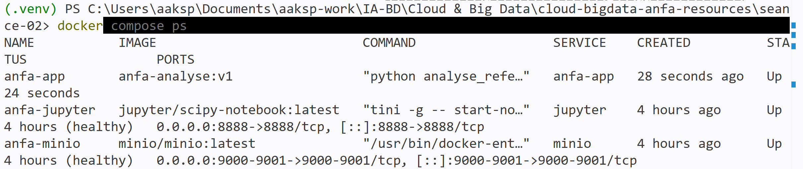
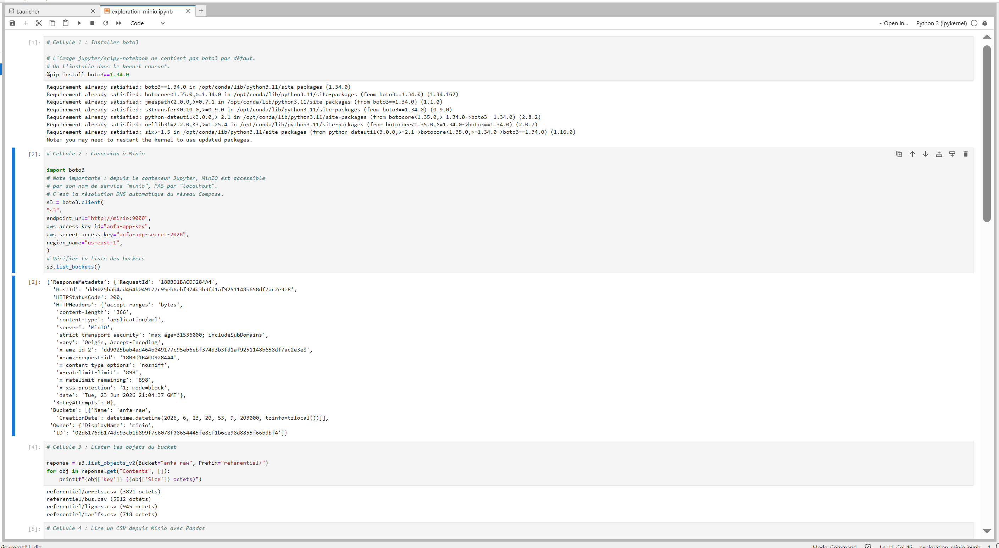
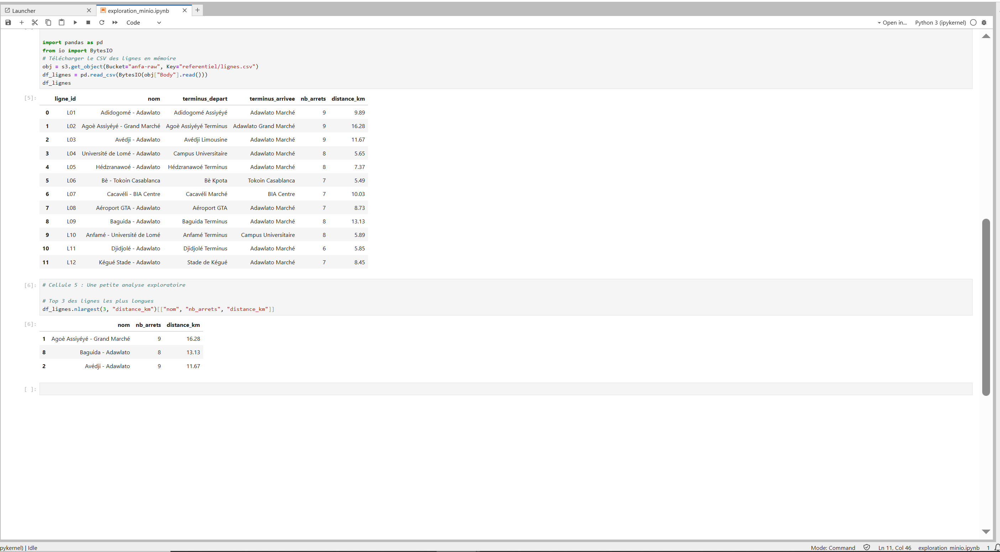

# Rendu - Séance 2

**Nom et prénom :** AHLI Kossi Sitsofe Pédro
**Identifiant GitHub :** aksp66
**Date de soumission :** 24/06/2026

## Résumé de la séance

Cette séance a permis de comprendre les fondations de la conteneurisation (namespaces, cgroups, union filesystems) et sa différence avec la virtualisation (hyperviseurs de type 1/2/3, VM vs conteneur), ainsi que la place de Docker dans l'histoire (LXC, OCI, runc/containerd). Sur le plan pratique, j'ai écrit un Dockerfile pour conteneuriser le script PySpark d'analyse du référentiel Anfa, construit l'image `anfa-analyse:v1`, observé l'effet du `.dockerignore` et du cache Docker, puis orchestré un stack à 3 services (MinIO, Jupyter, anfa-app) avec Docker Compose, en explorant les données MinIO depuis un notebook Jupyter via boto3 et pandas.

## Étapes principales

1. Écriture du `Dockerfile` (et de `Dockerfile.multistage` en bonus) et construction de l'image `anfa-analyse:v1` (taille observée : ~1,17 Go).
2. Mise en place du `.dockerignore` et observation du cache de Docker (étapes `CACHED` lors d'un rebuild sans modification, puis invalidation ciblée de `COPY . .` après modification du code).
3. Écriture du `docker-compose.yml` orchestrant MinIO (avec healthcheck), Jupyter, et l'image custom `anfa-app`.
4. Recréation du bucket `anfa-raw` et de la clé applicative `anfa-app-key` dans le volume MinIO de la séance 2 (`seance-02_minio-data`, distinct du volume `anfa-minio-data` de la séance 1, donc vide au départ), puis rechargement du référentiel CSV via `seance-01/upload_referentiel.py`.
5. Création et exécution du notebook `notebooks/exploration_minio.ipynb`, qui lit les données depuis MinIO via boto3 et pandas.
6. Tentative du bonus multi-stage (`Dockerfile.multistage`) : build non abouti (voir section dédiée).

## Captures d'écran

### docker compose ps



### Notebook Jupyter




## Bonus multi-stage (optionnel)

Non abouti. Le `docker build -f Dockerfile.multistage` a échoué à plusieurs reprises avec une erreur `EOF` côté moteur Docker (`failed to receive status: rpc error: code = Unavailable`), y compris avec le builder legacy (`DOCKER_BUILDKIT=0`) et après nettoyage du cache de build. Le moteur Docker Desktop a même perdu l'état de ses conteneurs en cours de tentative, signe d'une instabilité du moteur plutôt que d'une erreur dans le `Dockerfile.multistage` lui-même. La machine ne disposant que de 8 Go de RAM, l'augmentation de la mémoire allouée à Docker Desktop n'était pas une option raisonnable. Ce point n'étant pas noté, il a été laissé de côté pour prioriser les livrables obligatoires ; aucune comparaison de taille v1/v2 n'est donc disponible.

## Réponses aux exercices d'application

### Exercice 1 : QCM conceptuel

**1.1** Réponse : **C.** Un conteneur partage le noyau de la machine hôte. Contrairement à une VM qui embarque un OS complet avec son propre noyau, un conteneur Docker n'est qu'un processus isolé par les namespaces et limité par les cgroups, exécuté sur le noyau Linux de l'hôte.

**1.2** Réponse : **B.** L'image est un modèle figé en lecture seule ; le conteneur est une instance en cours d'exécution. C'est l'analogie classe/objet : on instancie autant de conteneurs que l'on veut à partir d'une même image.

**1.3** Réponse : **B.** Les namespaces. Ce sont eux qui donnent à un processus l'illusion d'être seul au monde (PID, NET, MNT, UTS, IPC, USER, CGROUP).

**1.4** Réponse : **A.** Les cgroups. Ils encadrent ce qu'un processus peut consommer (CPU, mémoire, I/O, nombre de processus), évitant qu'un conteneur ne monopolise toutes les ressources de l'hôte.

**1.5** Réponse : **B.** Dans une machine virtuelle Linux invisible gérée par Docker Desktop. macOS n'a pas de noyau Linux, donc pas de namespaces/cgroups natifs ; Docker Desktop fait tourner une VM Linux légère en arrière-plan via l'Apple Virtualization Framework.

**1.6** Réponse : **B.** La société d'origine qui a créé et open-sourcé Docker en 2013. DotCloud était un PaaS en difficulté qui a open-sourcé son outil interne de conteneurisation, lequel a connu une adoption explosive ; la société s'est ensuite rebaptisée Docker, Inc.

**1.7** Réponse : **C.** Docker a apporté un format d'image portable, une CLI simple et un registre public, en s'appuyant sur les mêmes primitives que LXC. Techniquement, Docker n'a rien inventé (mêmes namespaces/cgroups que LXC) ; sa contribution est une révolution d'ergonomie pour les développeurs, pas de technologie noyau.

**1.8** Réponse : **B.** Open Container Initiative — une norme ouverte pour les images et le runtime, fondée en 2015 par Docker, CoreOS, Google, IBM, Microsoft et RedHat.

### Exercice 2 : Lecture et analyse d'un Dockerfile

```dockerfile
FROM python:3.11
WORKDIR /application
COPY . /application
RUN pip install -r requirements.txt
EXPOSE 5000
CMD ["python", "main.py"]
```

**2.1 — Une phrase par instruction :**

- `FROM python:3.11` : définit l'image de base (Python 3.11 complet) sur laquelle toutes les couches suivantes sont construites.
- `WORKDIR /application` : définit `/application` comme répertoire de travail courant dans le conteneur (équivalent d'un `cd`, créé automatiquement s'il n'existe pas).
- `COPY . /application` : copie tout le contenu du contexte de build (le dossier de l'hôte passé à `docker build`) vers `/application` dans l'image.
- `RUN pip install -r requirements.txt` : exécute `pip install`, au moment du build, depuis `/application`, pour installer les dépendances listées dans `requirements.txt`.
- `EXPOSE 5000` : documente que l'application écoute sur le port 5000 ; instruction purement informative.
- `CMD ["python", "main.py"]` : définit la commande exécutée par défaut au démarrage du conteneur.

**2.2 — `EXPOSE 5000` vs `-p 5000:5000` :**

`EXPOSE` est purement documentaire : il n'ouvre aucun port réellement, il informe seulement les lecteurs du Dockerfile (et certains outils) du port utilisé par l'application à l'intérieur du conteneur. `-p 5000:5000` sur `docker run` effectue le mappage réseau réel qui publie le port 5000 du conteneur sur le port 5000 de l'hôte, rendant le service accessible depuis l'extérieur. Sans `-p`, même avec `EXPOSE`, le port reste inaccessible depuis l'hôte.

**2.3 — Deux problèmes et leurs corrections :**

1. **Ordre du cache cassé.** `COPY . /application` est placé avant `RUN pip install -r requirements.txt`. Toute modification du code applicatif invalide donc la couche `COPY`, ce qui invalide aussi (à cause de l'ordre) la couche `pip install` suivante : les dépendances sont réinstallées à chaque build, même si `requirements.txt` n'a pas changé. *Correction :* copier `requirements.txt` seul, lancer `pip install`, puis copier le reste du code.
2. **Exécution en root.** Aucune instruction `USER` n'est présente : le conteneur s'exécute avec les pleins pouvoirs root par défaut. Si l'application est compromise, l'attaquant hérite de ces privilèges dans le conteneur. *Correction :* créer un utilisateur dédié non privilégié (`RUN useradd --create-home appuser`) et basculer dessus avec `USER appuser` avant le `CMD`.

**2.4 — Version corrigée :**

```dockerfile
FROM python:3.11-slim

WORKDIR /application

# Copie seulement les dépendances en premier pour profiter du cache Docker
COPY requirements.txt .
RUN pip install --no-cache-dir -r requirements.txt

# Utilisateur non-root pour l'exécution
RUN useradd --create-home appuser
USER appuser

# Copie le code applicatif en dernier (couche la plus susceptible de changer)
COPY --chown=appuser:appuser . .

EXPOSE 5000

CMD ["python", "main.py"]
```

### Exercice 3 : Diagnostic

**3.1 Le build qui échoue**

a. **Cause précise :** `RUN pip install -r requirements.txt` s'exécute avant `COPY . .`. Au moment de ce `RUN`, le système de fichiers du conteneur en construction ne contient encore aucun fichier du projet (rien n'a été copié) : `requirements.txt` n'existe donc pas à cet instant, d'où `No such file or directory`.

b. **Correction :**
```dockerfile
FROM python:3.11-slim
WORKDIR /app
COPY requirements.txt .
RUN pip install -r requirements.txt
COPY . .
CMD ["python", "main.py"]
```

c. **Pourquoi cette erreur illustre une mauvaise compréhension de Docker :** l'étudiant raisonne comme si le Dockerfile s'exécutait dans le dossier du projet sur l'hôte, où `requirements.txt` « existe déjà ». En réalité, chaque instruction `RUN` s'exécute à l'intérieur du système de fichiers isolé de l'image en cours de construction, qui ne contient que ce que des instructions `COPY`/`ADD` antérieures y ont explicitement placé. Le build Docker est une séquence strictement isolée et ordonnée d'étapes, pas un script shell qui voit le disque de l'hôte.

**3.2 Le conteneur qui ne voit pas l'autre**

a. **Erreur dans `DATABASE_URL` :** l'URL utilise `localhost`, qui depuis le conteneur `api` désigne le conteneur `api` lui-même (chaque conteneur a son propre namespace réseau). Aucun serveur Postgres n'écoute sur le `localhost` de `api`, d'où `connection refused`.

b. **Correction :** remplacer `localhost` par le nom du service Compose `db`, résolu automatiquement par le DNS interne du réseau créé par Compose :
```yaml
DATABASE_URL: "postgresql://user:password@db:5432/anfa"
```

### Exercice 4 : Optimisation d'image

**a. Au moins quatre problèmes :**

1. **`apt-get update` et `apt-get install` sur des `RUN` séparés** : chaque `RUN` crée une couche distincte ; une couche `update` ancienne combinée à une couche `install` plus récente peut installer des paquets obsolètes en cache, et casse la bonne pratique d'atomicité.
2. **Pas de nettoyage du cache apt** (`rm -rf /var/lib/apt/lists/*` absent) : les listes de paquets téléchargées par `apt-get update` restent dans l'image, la gonflant inutilement.
3. **Outils de build inutiles à l'exécution** (`curl`, `wget`, `git`, `build-essential`) : `requests` est une bibliothèque pure Python qui ne nécessite aucune compilation native ; ces paquets (notamment `build-essential`, plusieurs dizaines de Mo) ne servent à rien au runtime et gonflent l'image pour rien.
4. **`COPY . /app` avant `RUN pip3 install -r requirements.txt`** : l'ordre casse le cache Docker — toute modification du code applicatif force la réinstallation des dépendances Python à chaque build.
5. **Pas de `--no-cache-dir` sur `pip3 install`** : le cache de téléchargement pip reste dans l'image, ajoutant un poids inutile.
6. **Exécution en root** : aucune instruction `USER`, donc le conteneur tourne avec les pleins privilèges par défaut.

**b. Version optimisée :**

```dockerfile
# Image de base légère : pas besoin de l'OS Ubuntu complet pour une appli Python
FROM python:3.11-slim

WORKDIR /app

# Copie seulement requirements.txt en premier : profite du cache Docker
COPY requirements.txt .

# Une seule couche RUN, cache pip désactivé.
# requests est pur Python : pas besoin de build-essential/curl/wget/git.
RUN pip install --no-cache-dir -r requirements.txt

# Utilisateur non-root pour l'exécution
RUN useradd --create-home appuser
USER appuser

# Copie le code applicatif en dernier (couche la plus susceptible de changer)
COPY --chown=appuser:appuser . .

CMD ["python3", "downloader.py"]
```

Avec ces changements, l'image passe d'environ 1,1 Go à quelques dizaines de Mo (base `python:3.11-slim` + `requests` seul, sans toolchain de compilation).

### Exercice 5 : Mini-cas d'architecture

**a. Services à conteneuriser dans le `docker-compose.yml` :**

- **`ftp-ingest`** : exécute chaque nuit le script Python qui lit les positions GPS sur le FTP, les nettoie, et écrit les résultats agrégés dans MinIO.
- **`minio`** : stockage objet S3 qui centralise les données agrégées, partagé entre le pipeline d'ingestion et le notebook d'exploration.
- **`jupyter`** : notebook utilisé par Kossi pour explorer les données stockées dans MinIO et produire des graphiques.

**b. Restart policy pour le script FTP :** `on-failure`. C'est un job batch qui doit se terminer proprement après son traitement nocturne (pas `always`/`unless-stopped`, qui le relanceraient en boucle même après un succès) ; mais on veut qu'il retente automatiquement en cas d'échec transitoire (FTP indisponible, coupure réseau), ce que `no` ne permettrait pas.

**c. Passer la date au script :**

1. **Variable d'environnement** : `environment: RUN_DATE: "2026-03-12"` dans le Compose, ou `docker run -e RUN_DATE=2026-03-12 ...` pour une reprise ponctuelle. Le script lit `os.environ["RUN_DATE"]`.
2. **Argument de ligne de commande** : override de la commande du conteneur, ex. `command: ["python", "pipeline.py", "--date", "2026-03-12"]`.

*Recommandation :* la **variable d'environnement**, car elle s'intègre nativement dans Compose (`environment:`) sans toucher à la commande de base, se surcharge facilement lors d'un `docker run -e` ponctuel pour une reprise d'historique, et reste découplée du code (le script n'a qu'à lire une variable, pas à parser des arguments).

**d. Pourquoi pas tout mettre dans le conteneur Jupyter ?**

Jupyter et le pipeline d'ingestion ont des cycles de vie et des responsabilités différentes : le notebook est un outil interactif lancé à la demande par un humain et qui doit rester disponible en permanence pour l'exploration, tandis que le script FTP est un job batch automatisé qui démarre, s'exécute et s'arrête chaque nuit (`restart: on-failure`). Les fusionner dans un seul conteneur empêcherait de définir des politiques de redémarrage, des ressources et des mises à jour indépendantes pour chacun, et un crash ou une montée de version de l'un impacterait l'autre sans raison. Séparer les conteneurs respecte le principe « un conteneur, une responsabilité », essentiel pour la maintenabilité et l'observabilité.

**e. Squelette de `docker-compose.yml` :**

```yaml
services:
  minio:
    image: minio/minio:latest
    ports:
      - "9000:9000"
      - "9001:9001"
    volumes:
      - minio-data:/data
    command: server /data --console-address ":9001"

  ftp-ingest:
    build: ./ftp-ingest
    depends_on:
      - minio
    environment:
      RUN_DATE: "2026-03-12"
    restart: "on-failure"

  jupyter:
    image: jupyter/scipy-notebook:latest
    ports:
      - "8888:8888"
    depends_on:
      - minio
    volumes:
      - ./notebooks:/home/jovyan/work

volumes:
  minio-data:
```

## Difficultés rencontrées

- **`InvalidAccessKeyId` dans le notebook Jupyter** : causé par le volume MinIO de la séance 2 (`seance-02_minio-data`), distinct de celui de la séance 1 et donc vide (ni bucket `anfa-raw`, ni clé applicative). Résolu en recréant le bucket et la clé `anfa-app-key` via `mc` dans le conteneur `anfa-minio`, puis en réuploadant le référentiel avec `seance-01/upload_referentiel.py`.
- **`IndentationError` dans une cellule du notebook** : le `print()` du `for` avait perdu son indentation lors d'un copier-coller. Corrigé en réindentant la ligne sous le `for`.
- **Stack Compose incomplète après une interruption** : un premier `docker compose up -d --build` a été interrompu en cours de route, laissant `anfa-app` au statut `Created` sans que MinIO ni Jupyter n'existent. Résolu en relançant `docker compose up -d`.
- **Bonus `Dockerfile.multistage` non abouti** : échecs répétés du build (`EOF` côté moteur Docker), y compris avec le builder legacy et après nettoyage du cache, avec une perte de l'état des conteneurs en cours de tentative — instabilité du moteur Docker Desktop sur une machine à 8 Go de RAM, non liée au contenu du Dockerfile. Non résolu, mis de côté car non noté.
