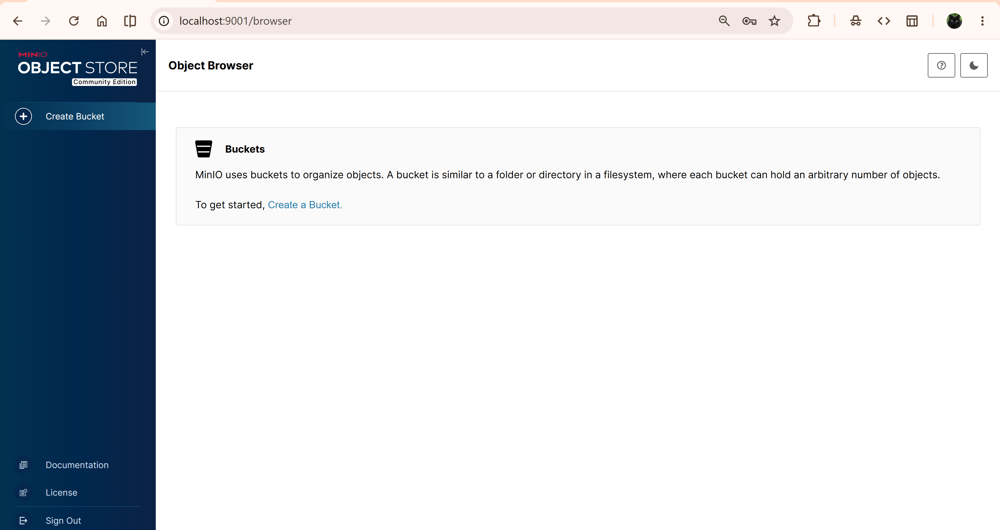
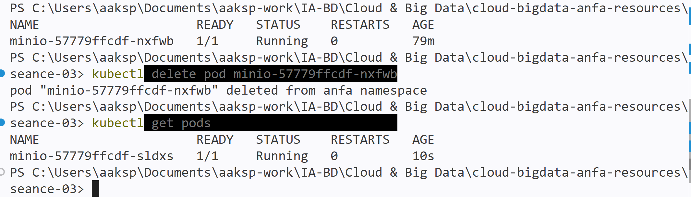
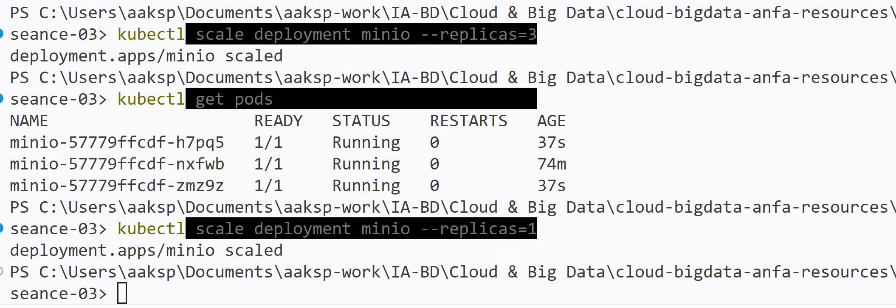

# Rendu Séance 3

**Nom et prénom :** AHLI Kossi Sitsofe Pédro
**Identifiant GitHub :** aksp66
**Date de soumission :** 25/06/2026

## Résumé de la séance

Cette séance a introduit Kubernetes comme réponse aux limites de Docker Compose en production (une seule machine = un seul point de défaillance, pas de self-healing, scaling manuel) : architecture Control Plane (API Server, etcd, Scheduler, Controller Manager) / Worker Nodes (kubelet, kube-proxy, container runtime), et objets fondamentaux Pod, Deployment, Service, PersistentVolumeClaim, Namespace. En pratique, j'ai installé Kind et kubectl, créé un cluster local `anfa`, déployé MinIO via 3 manifestes YAML (PVC, Deployment, Service), observé concrètement le self-healing après suppression d'un pod, scalé le Deployment de 1 à 3 puis retour à 1 replica, et activé l'Ingress Controller nginx.

## Étapes principales

1. Installation de Kind (v0.32.0, via `winget`) et vérification de kubectl (déjà installé, v1.34.1).
2. Création du cluster Kubernetes local `anfa` avec Kind (image `kindest/node:v1.35.1`) ; le nœud `anfa-control-plane` passe en `Ready`.
3. Création du namespace `anfa` et configuration de kubectl pour l'utiliser par défaut (`kubectl config set-context --current --namespace=anfa`).
4. Déploiement de MinIO via 3 manifestes YAML (`minio-pvc.yaml`, `minio-deployment.yaml`, `minio-service.yaml`) : PVC `Bound` (2Gi), Deployment `1/1` `Running`, Service `NodePort` exposant les ports 30900 (API) et 30901 (console).
5. Observation du self-healing : suppression manuelle du pod MinIO (`kubectl delete pod`), recréation automatique d'un nouveau pod par le Deployment, sans intervention humaine (voir détail dans « Difficultés rencontrées »).
6. Scaling du Deployment de 1 à 3 replicas (`kubectl scale deployment minio --replicas=3`), vérification des 3 pods `Running`, puis retour à 1 replica.
7. Installation et vérification de l'Ingress Controller nginx (`ingress-nginx-controller` en `Running` dans le namespace `ingress-nginx`).

## Captures d'écran

### Console MinIO accessible via port-forward



### Self-healing observé



### Scaling à 3 replicas



## Réponses aux exercices d'application

### Exercice 1 : QCM conceptuel

**1.1** Réponse : **B.** Kubernetes orchestre des conteneurs sur un cluster de machines, en s'appuyant sur un container runtime (containerd, Docker, CRI-O). K8s ne remplace pas Docker : il a besoin d'un moteur d'exécution de conteneurs sous-jacent, qu'il pilote.

**1.2** Réponse : **B.** etcd. C'est la base de données clé-valeur qui stocke l'état complet et persistant du cluster.

**1.3** Réponse : **C.** Scheduler. Il décide sur quel Worker Node placer chaque nouveau pod, selon les ressources disponibles et les contraintes.

**1.4** Réponse : **C.** À l'API Server, qui est le point d'entrée unique du cluster. `kubectl` ne parle jamais directement à etcd, au Scheduler ou aux pods.

**1.5** Réponse : **B.** Le Deployment recrée immédiatement un nouveau pod pour respecter l'état souhaité. C'est exactement ce que j'ai observé en partie 6 du TP.

**1.6** Réponse : **B.** NodePort. Il expose le service sur un port de chaque nœud du cluster, sans dépendre d'un load balancer cloud (contrairement à `LoadBalancer`).

**1.7** Réponse : **B.** Elle modifie l'état souhaité du Deployment à 5 replicas ; Kubernetes converge vers ce nombre (et non « +5 » en plus des replicas existants).

**1.8** Réponse : **B.** À isoler logiquement les ressources (séparation par équipe, environnement, ou application).

**1.9** Réponse : **B.** Des conteneurs Docker. Confirmé en TP : `docker ps` montre le conteneur `anfa-control-plane` basé sur l'image `kindest/node`.

### Exercice 2 : Lecture et interprétation d'un manifeste

**2.1** `selector.matchLabels` indique au Deployment **quels pods il doit gérer/surveiller** : tous les pods portant les labels listés. Il doit correspondre exactement aux labels définis dans `template.metadata.labels`, qui sont les labels que le Deployment appose lui-même aux pods qu'il crée — c'est ce lien qui permet au Deployment de reconnaître « ses » pods parmi tous ceux du cluster.

**2.2** `replicas: 2` → **2 pods** sont créés. Si l'un meurt, le Deployment (via son ReplicaSet) le remarque immédiatement (état observé = 1 ≠ état souhaité = 2) et **recrée automatiquement** un nouveau pod pour revenir à 2 — c'est le self-healing.

**2.3** `minio` est le nom du **Service** Kubernetes qui expose le Deployment MinIO. On utilise ce nom plutôt qu'une IP parce que l'IP d'un pod (et même celle d'un Service en théorie) n'est pas garantie stable dans le temps. Ce qui rend cette résolution possible : **CoreDNS**, le serveur DNS interne du cluster, qui résout automatiquement le nom d'un Service vers son ClusterIP — l'équivalent du DNS interne de Docker Compose vu en séance 2.

**2.4** Sans Service, les pods de `anfa-api` ne sont joignables que par leur **IP de pod interne**, éphémère et qui change à chaque recréation. Aucune autre ressource du cluster ne peut donc appeler l'API de façon fiable, et il n'y a **aucun accès possible depuis l'extérieur du cluster** (pas de port exposé).

**2.5**

```yaml
apiVersion: v1
kind: Service
metadata:
  name: anfa-api
  namespace: anfa
spec:
  type: ClusterIP
  selector:
    app: anfa-api
  ports:
    - port: 80
      targetPort: 8000
```

### Exercice 3 : Diagnostic

**3.1 Le pod qui ne démarre pas**

a. `ImagePullBackOff` signifie que Kubernetes a essayé de télécharger l'image du conteneur, a échoué, et attend désormais un délai croissant (backoff exponentiel) avant de réessayer.

b. Cause très probable : faute de frappe dans le nom de l'image (`minio/miniooo` au lieu de `minio/minio`) — cette image n'existe pas sur Docker Hub, le pull échoue systématiquement.

c. `kubectl describe pod <nom-du-pod>` : la section `Events` affiche le message d'erreur précis du pull (j'ai utilisé exactement cette commande en TP pour diagnostiquer un `ErrImagePull` réel, voir Difficultés rencontrées).

**3.2 Le PVC qui ne se lie pas**

a. `Pending` pour un PVC signifie que Kubernetes n'a pas encore trouvé ou provisionné de `PersistentVolume` capable de satisfaire la demande (taille, accessModes, StorageClass).

b. Cause la plus probable dans un cluster Kind local : **500 Gi est démesuré** par rapport à l'espace disque réellement disponible sur le nœud (qui est lui-même un conteneur Docker partageant le disque de la machine hôte) — le provisioner `local-path` de Kind ne peut pas allouer un volume aussi gros.

c. `kubectl describe pvc data-pvc` (section `Events`) pour voir le message d'erreur de provisioning, et `kubectl get storageclass` pour vérifier le `StorageClass` disponible.

**3.3 Le port-forward qui échoue**

a. `kubectl port-forward` ne peut rediriger un port que vers un conteneur **réellement démarré** ; tant que le pod est `Pending` (pas encore `Running`), il n'y a rien à raccorder, d'où l'erreur immédiate.

b. `kubectl describe pod <nom-du-pod-minio>` (ou `kubectl get events`) pour voir pourquoi le scheduler ne parvient pas à faire passer le pod en `Running` (PVC non `Bound`, image qui ne se télécharge pas, ressources insuffisantes, etc.).

c. Ordre logique : déployer les ressources dans l'ordre de dépendance (PVC → Deployment → Service), attendre que le pod soit `Running` (`kubectl get pods` ou `kubectl wait`), vérifier que le Service cible bien ce pod, et **seulement ensuite** lancer le `port-forward`.

### Exercice 4 : De Docker Compose à Kubernetes

**4.1** Trois manifestes distincts sont nécessaires :

- **PersistentVolumeClaim** : demande de stockage persistant (remplace `volumes: minio-data:`).
- **Deployment** : décrit le pod MinIO, l'image, les variables d'environnement, et garantit qu'il reste vivant (remplace `services: minio:` côté image/environment/command).
- **Service** : adresse réseau stable et exposition des ports (remplace `ports:` de Compose), avec sélection des pods par labels.

**4.2** Un volume Docker nommé est une simple zone de stockage gérée directement par le moteur Docker sur la machine hôte, attachée à un conteneur sans abstraction supplémentaire — un seul niveau. En Kubernetes, la persistance est **découplée en deux objets** : un `PersistentVolume` (la ressource de stockage réelle — disque local, SAN, EBS chez AWS…) et un `PersistentVolumeClaim` (une demande abstraite « je veux X Go avec tel accessMode ») que K8s associe dynamiquement à un PV disponible. Cette indirection permet de changer le type de stockage sous-jacent sans toucher au manifeste applicatif.

**4.3** En Compose, le conteneur tourne directement sur la machine hôte et Compose mappe le port du conteneur sur un port de `localhost`. Avec Kind, les « nœuds » Kubernetes sont eux-mêmes des **conteneurs Docker** (couche d'indirection réseau supplémentaire) : le `NodePort` n'expose le service que sur l'IP interne du nœud (le conteneur Kind), pas sur le `localhost` réel de la machine hôte — d'où le besoin de `kubectl port-forward` pour faire le pont. Pour un accès direct sur un port de l'hôte comme avec Compose, il faudrait soit configurer Kind avec des `extraPortMappings` dans son fichier de configuration au moment de la création du cluster, soit utiliser un vrai cluster cloud avec un Service de type `LoadBalancer`.

**4.4** Deux choses observées concrètement en TP :

1. **Self-healing** : après `kubectl delete pod`, un nouveau pod a été recréé automatiquement par le Deployment, sans intervention manuelle — ce que Compose ne fait pas (un conteneur arrêté reste arrêté).
2. **Scaling déclaratif instantané** (`kubectl scale deployment minio --replicas=3`) qui crée/détruit les replicas nécessaires en une commande, alors que le scaling Compose reste basique et local à une seule machine.

### Exercice 5 : Mini-cas d'architecture

**5.1**

- **`pipeline-anfa` → CronJob.** Tâche planifiée chaque nuit à heure fixe (2h), qui se termine après ~15 minutes : c'est exactement le cas d'usage d'un CronJob (déclenchement périodique d'un Job ponctuel).
- **`anfa-api` → Deployment.** Service qui doit rester toujours disponible et dont la charge varie fortement (besoin de scaler horizontalement) : c'est le rôle naturel du Deployment (combiné à un HPA, voir 5.2).
- **`anfa-dashboard` → Deployment.** Application web sans état, disponibilité standard, faible nombre d'utilisateurs simultanés : un Deployment (peu de replicas) suffit largement.

**5.2** `minReplicas: 2`, `maxReplicas: 8`, métrique cible : utilisation CPU moyenne ~65-70 %. Justification : le trafic varie d'un facteur ~10 entre les heures creuses (~5 req/s) et les heures de pointe (~50 req/s) ; 2 replicas minimum garantissent la haute disponibilité et la répartition de charge même hors pointe, tandis que l'autoscaling jusqu'à 8 replicas absorbe automatiquement les pics du matin et du soir sans dimensionnement statique surdimensionné le reste du temps.

**5.3** **LoadBalancer.** L'API doit être accessible depuis l'extérieur du cluster par les applications mobiles des conducteurs (donc pas `ClusterIP`, réservé à l'interne) ; sur un cluster managé chez un fournisseur cloud, `LoadBalancer` provisionne automatiquement un load balancer externe avec une IP publique stable répartissant le trafic entre tous les replicas — le mode recommandé en production (contrairement à `NodePort`, plus basique, pensé pour du dev/test).

**5.4** Par défaut, Kubernetes effectue un **rolling update** : lors d'une mise à jour d'image, K8s crée progressivement de nouveaux pods avec la nouvelle version, attend qu'ils soient `Ready`, puis retire progressivement les anciens pods, par petits groupes successifs (contrôlé par `maxSurge`/`maxUnavailable`). À aucun moment tous les pods ne sont indisponibles simultanément : il y a toujours suffisamment de pods (anciens ou nouveaux) prêts à répondre, donc la mise à jour se fait sans coupure perceptible. En cas de problème, `kubectl rollout undo` permet un retour arrière en une commande.

**5.5**

```yaml
apiVersion: apps/v1
kind: Deployment
metadata:
  name: anfa-api
  namespace: anfa
spec:
  replicas: 3
  selector:
    matchLabels:
      app: anfa-api
  template:
    metadata:
      labels:
        app: anfa-api
    spec:
      containers:
        - name: api
          image: anfa/api:v1
          ports:
            - containerPort: 8000
          env:
            - name: MINIO_ENDPOINT
              value: "http://minio:9000"
```

## Difficultés rencontrées

- **PATH non rafraîchi après l'installation de Kind via `winget`** : le terminal ne reconnaissait pas la commande `kind` immédiatement après l'installation (nécessite normalement un redémarrage du shell). Résolu en copiant `kind.exe` dans un dossier déjà présent dans le `PATH` de la session en cours.
- **Incident transitoire pendant le test de self-healing** : après suppression du pod MinIO, le nouveau pod recréé par le Deployment a d'abord échoué à télécharger l'image (`ErrImagePull` → `ImagePullBackOff`), à cause d'un *TLS handshake timeout* passager vers Docker Hub (visible via `kubectl describe pod`). Kubernetes a réessayé automatiquement avec un backoff croissant, et le pod est passé en `Running` sans aucune intervention manuelle — une illustration supplémentaire, non prévue, de la résilience native de K8s face aux pannes transitoires.
- Aucune autre difficulté bloquante.
