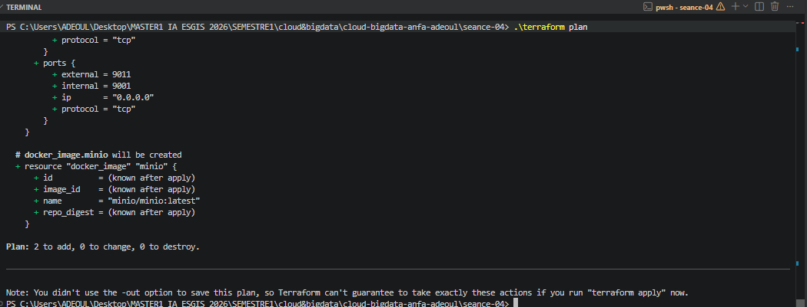
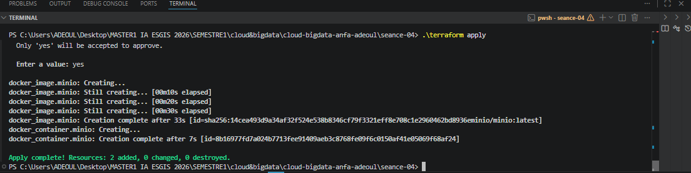
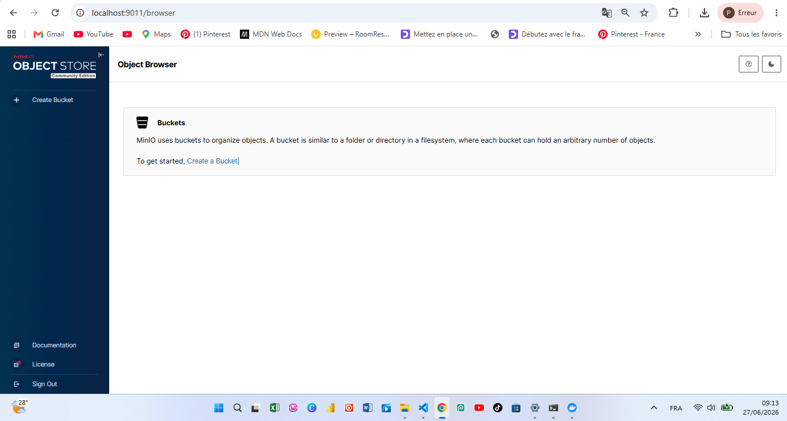
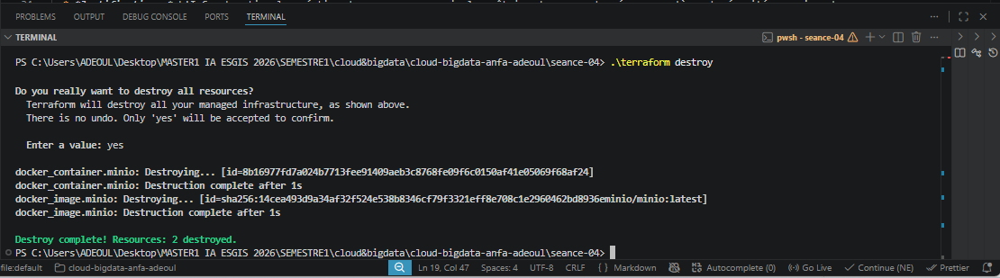

# Rendu Séance 4

**Nom et prénom :** ADEOUL Koffi Prosper
**Identifiant GitHub :** prosperadeoul-hub
**Date de soumission :** 27/06/2026

## Résumé de la séance
Au cours de cette séance, l'outil Terraform a été installé pour basculer sur une approche d'Infrastructure as Code (IaC). Une stack Docker complète (réseau, volume, images et conteneurs pour MinIO et Jupyter) a été entièrement décrite en langage HCL. Le workflow fondamental `init`, `plan`, `apply` et `destroy` a été maîtrisé, tout en appliquant les bonnes pratiques de gestion du fichier d'état (`.tfstate`) et de sécurisation des variables sensibles via les fichiers `.tfvars`.

## Étapes principales
1. **Installation de Terraform** : Configuration du binaire et vérification de la version locale.
2. **Premier contact et Workflow** : Déploiement d'un conteneur MinIO minimal pour appréhender le cycle de vie Terraform.
3. **Gestion du State et Sécurité** : Analyse du fichier `terraform.tfstate` et mise en place d'un `.gitignore` rigoureux pour exclure les secrets et l'état local de Git.
4. **Stack complète et Changements Incrémentaux** : Extension du script pour inclure un réseau et un volume Docker dédiés, et observation de la capacité de Terraform à modifier l'infrastructure à chaud sans tout détruire.
5. **Refactoring et Paramétrage** : Extraction des configurations figées dans un fichier `variables.tf` et externalisation des mots de passe dans un fichier `terraform.tfvars` sécurisé.

## Captures d'écran
### terraform plan (création initiale)

### terraform apply réussi

### Console MinIO créée par Terraform

### terraform destroy

## Réponses aux exercices d'application

### Exercice 1 - QCM conceptuel

* **1.1 Réponse : B. L'IaC remplace totalement la nécessité de comprendre l'infrastructure sous-jacente.**
  * *Justification :* L'IaC automatise la création des ressources, mais la maîtrise des concepts réseau, système et sécurité sous-jacents reste indispensable pour concevoir une architecture valide.
* **1.2 Réponse : B. Le déclaratif décrit l'état souhaité ; l'impératif décrit la séquence d'actions à effectuer.**
  * *Justification :* Avec Terraform (déclaratif), on décrit le résultat final attendu, et le moteur calcule lui-même les étapes nécessaires pour l'atteindre.
* **1.3 Réponse : B. Elle produit le même résultat quel que soit le nombre de fois où elle est appliquée.**
  * *Justification :* L'idempotence assure que si l'infrastructure réelle est déjà conforme au code, exécuter Terraform à nouveau ne provoquera aucun changement.
* **1.4 Réponse : B. À fournir un plugin qui sait communiquer avec une API spécifique (AWS, Docker, Kubernetes...).**
  * *Justification :* Les providers font office de traducteurs entre les requêtes génériques de Terraform et les spécificités des APIs des différents fournisseurs.
* **1.5 Réponse : B. Terraform compare le state au code, ne voit aucun écart, et n'effectue aucune action.**
  * *Justification :* Grâce au fichier de state, Terraform sait que l'infrastructure actuelle correspond en tout point à la configuration demandée.
* **1.6 Réponse : C. Mémoriser ce que Terraform a créé pour pouvoir suivre les changements incrémentaux.**
  * *Justification :* Le fichier `.tfstate` est la source de vérité de Terraform qui lui permet de connaître l'état réel existant à l'instant T.
* **1.7 Réponse : B. Parce qu'il peut contenir des secrets en clair (mots de passe, clés API) et peut être corrompu par des commits concurrents.**
  * *Justification :* Le fichier d'état contient l'intégralité des données configurées (y compris les mots de passe) au format JSON lisible, ce qui pose un risque majeur de sécurité.
* **1.8 Réponse : C. terraform plan**
  * *Justification :* La commande `terraform plan` simule l'exécution et montre explicitement les ajouts (+), modifications (~) et destructions (-) avant l'application réelle.
* **1.9 Réponse : B. Un fork open source de Terraform créé après le changement de licence de HashiCorp en 2023.**
  * *Justification :* OpenTofu a été lancé sous l'égide de la Linux Foundation pour préserver une alternative communautaire et strictement open source.
* **1.10 Réponse : B. Non, Terraform provisionne l'infrastructure, Ansible configure des machines existantes - ils sont complémentaires.**
  * *Justification :* Terraform s'occupe de la création de la structure (réseau, serveurs, disques) et Ansible intervient ensuite pour configurer l'intérieur du système d'exploitation.

---

### Exercice 2 - Lecture et interprétation d'un fichier Terraform

* **2.1 Liste des 4 ressources :**
  1. `docker_network.back` : Crée un réseau Docker isolé nommé `"anfa-backend"`.
  2. `docker_volume.data` : Initialise un volume nommé `"postgres-data"` pour la persistance des données.
  3. `docker_image.postgres` : Télécharge l'image officielle `"postgres:15"` depuis le registre distant.
  4. `docker_container.db` : Instancie le conteneur de base de données PostgreSQL en lui associant le réseau, le volume et l'image créés.
* **2.2 Rôle de la référence :** `docker_image.postgres.image_id` récupère dynamiquement l'identifiant interne de l'image téléchargée. Cela crée une dépendance implicite forte : Terraform comprend qu'il ne doit pas tenter de créer le conteneur tant que l'image n'est pas totalement disponible localement.
* **2.3 Ordre de création :** Terraform va créer en premier et en parallèle le réseau, le volume et l'image. Il créera obligatoirement le conteneur en dernier, car sa configuration dépend des trois ressources précédentes.
* **2.4 Problème de sécurité et correction :** Le mot de passe de la base de données est écrit en clair dans le code source (`"POSTGRES_PASSWORD=secret123"`). 
  * *Correction :* Il faut déclarer une variable sensible (`variable "db_pwd" { sensitive = true }`), l'appeler dans le conteneur (`"POSTGRES_PASSWORD=${var.db_pwd}"`), et renseigner sa valeur dans un fichier local `terraform.tfvars` ignoré par Git.
* **2.5 Impact du changement de port :** L'infrastructure ayant été préalablement détruite (`terraform destroy`), Terraform va simplement réinstancier l'ensemble des ressources à blanc en configurant cette fois le mappage externe sur le port `5433`.

---

### Exercice 3 - Diagnostic
* **3.1 Dépendance circulaire :**
  * **a.** L'erreur signifie que la ressource `a` dépend de `b`, qui elle-même dépend simultanément de `a`.
  * **b.** Terraform refuse de l'appliquer car il est impossible d'établir un ordre chronologique logique de création au sein du graphe de dépendances (le graphe devient cyclique).
  * **c.** Solution : Supprimer l'interdépendance dynamique en écrivant les chaînes de caractères des noms en dur dans les environnements au lieu de faire référence à l'objet opposé.
* **3.2 Le plan qui veut tout recréer :**
  * **a.** Terraform affiche `-/+` car les variables d'environnement d'un conteneur Docker ne sont pas modifiables à chaud. Pour appliquer le changement, le moteur est obligé de détruire l'instance actuelle et d'en créer une nouvelle.
  * **b.** Les données ne seront pas perdues si un volume Docker externe persistant est correctement configuré et monté sur le dossier de données du conteneur. Le conteneur est détruit, mais le volume reste intact.
  * **c.** Cette opération n'est pas gratuite car elle provoque une coupure de service temporaire (downtime) le temps de la recréation, ce qui peut interrompre les connexions des utilisateurs en production.
* **3.3 Le state corrompu :**
  * **a.** Risque de sécurité immédiat : Tous les mots de passe et configurations de l'infrastructure sont exposés publiquement en clair sur GitHub.
  * **b.** Risque technique : La machine d'Awa va tenter de modifier ou détruire des ressources Docker qui n'existent que sur le poste d'origine, entraînant des erreurs de désynchronisation massives.
  * **c.** Solution pérenne : Mettre en place un *remote backend* (ex: un bucket cloud sécurisé avec State Locking) pour externaliser le state hors de Git.

---

### Exercice 4 - Adaptation Compose → Terraform

terraform {
  required_providers {
    docker = {
      source  = "kreuzwerker/docker"
      version = "~> 3.0"
    }
  }
}

provider "docker" {}

variable "minio_root_password" {
  type        = string
  description = "Mot de passe racine pour l'administration de MinIO"
  default     = "anfa-password-2026"
  sensitive   = true # Masque la valeur dans les logs et le terminal
}

resource "docker_network" "anfa_net" {
  name = "anfa-shared-network"
}

resource "docker_volume" "minio_data" {
  name = "anfa-minio-data-tf"
}

resource "docker_image" "minio_img" {
  name = "minio/minio:latest"
}

resource "docker_image" "jupyter_img" {
  name = "jupyter/scipy-notebook:latest"
}

resource "docker_container" "minio" {
  name    = "anfa-minio"
  image   = docker_image.minio_img.image_id
  command = ["server", "/data", "--console-address", ":9001"]

  ports {
    internal = 9000
    external = 9000
  }

  ports {
    internal = 9001
    external = 9001
  }

  env = [
    "MINIO_ROOT_USER=anfa-admin",
    "MINIO_ROOT_PASSWORD=${var.minio_root_password}" # Utilisation de la variable sécurisée
  ]

  volumes {
    volume_name    = docker_volume.minio_data.name
    container_path = "/data"
  }

  networks_advanced {
    name = docker_network.anfa_net.name
  }
}

resource "docker_container" "jupyter" {
  name  = "anfa-jupyter"
  image = docker_image.jupyter_img.image_id

  ports {
    internal = 8888
    external = 8888
  }

  env = [
    "JUPYTER_TOKEN=anfa-token"
  ]

  networks_advanced {
    name = docker_network.anfa_net.name
  }

}

---

### Exercice 5 - Mini-cas d'architecture

* **5.1 4 ressources Cloud (OVHcloud) :**
  1. Un bucket de stockage objet (S3 compatible) pour archiver les CSV et les logs GPS.
  2. Un cluster Kubernetes managé pour héberger l'API et l'infrastructure Spark.
  3. Un Node Pool (groupe de machines) configuré avec autoscaling pour ajuster les ressources Spark.
  4. Un Load Balancer public pour exposer le tableau de bord Grafana sur internet.
* **5.2 Recommandation de structure :** Je recommande vivement l'**Approche B (fichiers séparés)**. Cela évite d'avoir un fichier monolithique illisible, facilite la relecture de code (Code Review) lors des Pull Requests, et permet à plusieurs développeurs de travailler sur des briques différentes sans conflits majeurs.
* **5.3 Deux mécanismes multi-environnements :** Terraform propose l'usage des **Workspaces** (pour isoler les states d'un même code) et l'utilisation de **fichiers de variables dédiés** (ex: `dev.tfvars` et `prod.tfvars`) passés en paramètre à l'exécution.
* **5.4 Réponse au Directeur Technique sur la migration :** La migration demandera un effort d'ingénierie important et ne sera pas immédiate. Bien que l'architecture logique reste identique (le concept de stockage objet ou de cluster reste le même), le code HCL de Terraform devra être entièrement réécrit car les types de ressources et les APIs diffèrent totalement entre le provider OVHcloud et le provider AWS.
* **5.5 3 bonnes pratiques pour le travail en équipe (4 personnes) :**
  1. Utilisation obligatoire d'un **Remote Backend centralisé** avec mécanisme de verrouillage (State Locking).
  2. Intégration stricte d'un fichier `.gitignore` pour interdire l'envoi de secrets ou de fichiers d'état locaux.
  3. Automatisation d'une validation par Pull Request exigeant la vérification d'un `terraform plan` avant chaque fusion sur la branche principale.

## Difficultés rencontrées
1. Problème d'exécution du binaire sous PowerShell Windows
* Difficulté : Lors de la première tentative d'exécution de la commande terraform version, PowerShell a retourné une erreur indiquant que le terme 'terraform' n'était pas reconnu comme un programme exécutable, bien que le fichier terraform.exe soit présent dans le dossier de travail.

* Solution : La solution a été d'utiliser le préfixe .\ devant chaque commande (.\terraform version, .\terraform apply).

2. Conflit de suppression d'image Docker lors du nettoyage
* Difficulté : Lors de l'exécution de .\terraform destroy, Terraform a échoué à supprimer l'image minio/minio:latest. Docker a bloqué l'action en signalant un conflit (conflict: unable to delete ... must be forced) à cause d'un ancien conteneur persistant (anfa-minio) issu des séances précédentes (Docker Compose) qui utilisait encore cette image.

* Solution : Identification du conteneur bloquant via la commande docker ps -a, puis suppression manuelle du conteneur parasite avec docker rm . Après ce nettoyage, la commande .\terraform destroy s'est exécutée sans problème.