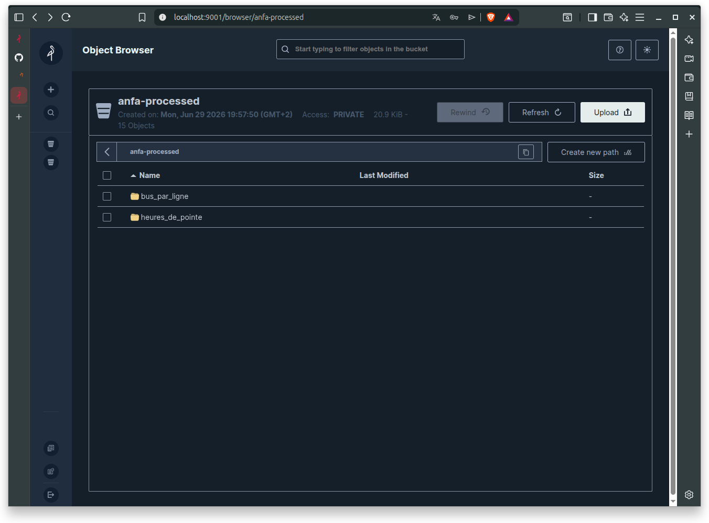
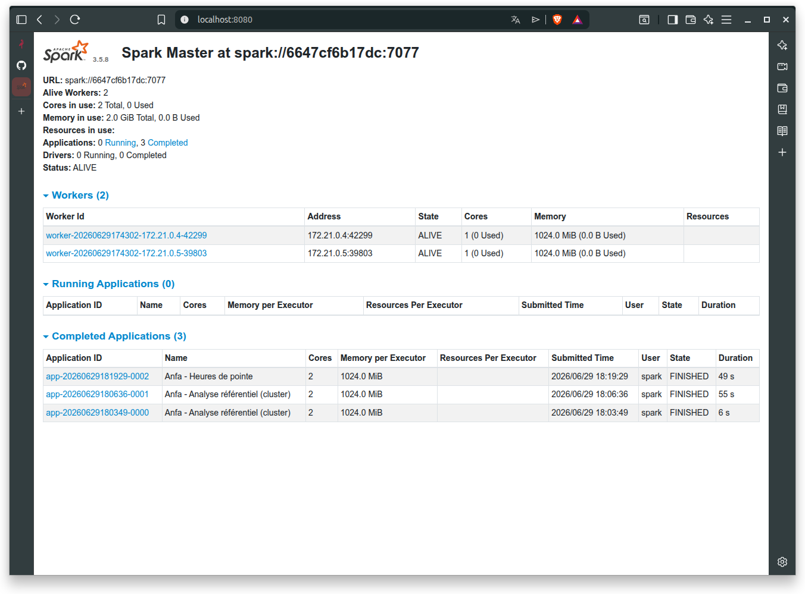
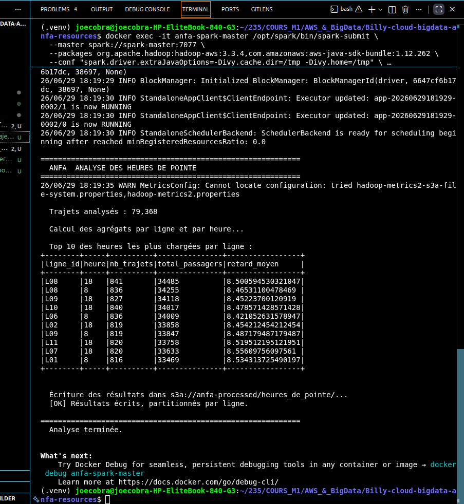

# OUMAROU BILLY N.
-

# Architecture Spark & Data Lake (MinIO)

## 1. Architecture du Cluster
Le cluster est déployé via `docker compose` et simule une infrastructure Big Data distribuée composée de quatre conteneurs :
* **MinIO** : Serveur de stockage objet compatible S3.
* **Spark Master** : Orchestrateur du cluster.
* **Spark Workers (x2)** : Nœuds de calcul traitant les tâches distribuées.

## 2. Préparation du Data Lake
* **Initialisation** : Création des buckets `anfa-raw` et `anfa-processed` via `mc` (MinIO Client).
* **Ingestion** : Chargement du référentiel (`arrets.csv`, `bus.csv`, etc.) dans le bucket `anfa-raw`.
* **Validation** : La commande `docker exec -it anfa-minio mc ls local/anfa-raw/referentiel/` confirme la présence des données.

> **Capture :** `captures/MinIO.png`

## 3. Exécution des Jobs Spark
Les traitements ont été soumis via `spark-submit` en mode cluster.

### Job 1 : Analyse du Référentiel
* **Objectif** : Statistiques descriptives sur la flotte de bus et le réseau.
* **Résultat** : Calcul des capacités totales et répartition par ligne avec persistance en format **Parquet**.

### Job 2 : Génération de trajets (Simulation)
* **Objectif** : Simulation de 30 jours de trajets (79 368 entrées).
* **Technique** : Utilisation de `boto3` pour l'interaction avec le stockage objet.

### Job 3 : Analyse des heures de pointe
* **Objectif** : Agrégation des trajets par heure pour identifier les périodes de forte affluence.
* **Résultat** : Identification des heures de pointe (pics observés à 08h et 18h).

> **Capture :** `captures/Dashboard-spark.png` (Visualisation des jobs)

> **Capture :** `captures/heure-de-pointe.png` (Sortie du tableau d'analyse)

## 4. Difficultés rencontrées et Solutions
1. **Accès aux dépendances (`boto3`)** : Les Workers ne trouvant pas la bibliothèque, celle-ci a été installée en mode `root` dans le conteneur (`docker exec -u 0 anfa-spark-master pip install boto3`).
2. **Erreurs de cache Ivy** : Résolues en redirigeant le cache vers `/tmp/` via les configurations : `--conf "spark.driver.extraJavaOptions=-Divy.cache.dir=/tmp -Divy.home=/tmp"`.
3. **Persistance** : Utilisation du format Parquet pour assurer l'optimisation des requêtes analytiques futures.

## 5. Conclusion
Ce TP a permis de passer d'un environnement de développement local à une **architecture distribuée réelle**. La scalabilité est rendue possible par la répartition des tâches sur les deux workers, confirmant l'efficacité du modèle de programmation Spark pour le traitement de volumes de données croissants.